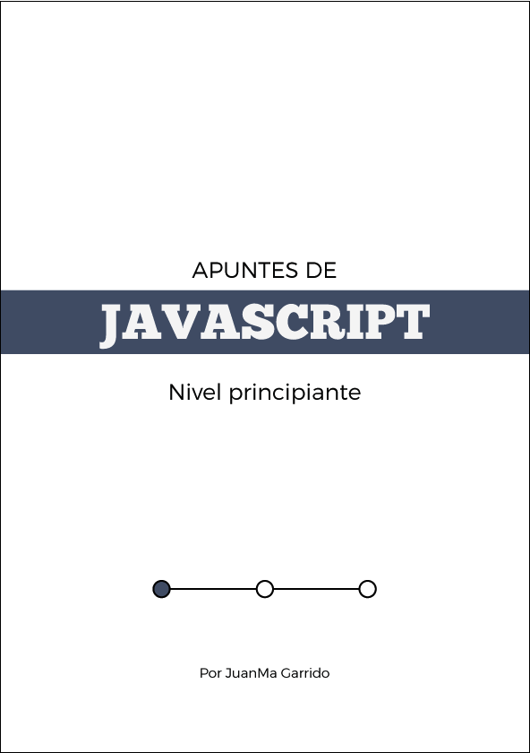

# Apuntes de Javascript I - Nivel Principiante

## Descripción ##

Este repositorio contiene los contenidos del libro **Apuntes de Javascript I - Nivel Principiante** que es el resultado de los materiales que he ido realizando para diferentes trainings JAVASCRIPT impartidos desde 2010.

Esta primera parte abarca todo lo necesario para arrancar con el lengiaje partiendo de cero e incluye:

- Ideas Claras sobre Javascript
- Primeros pasos
- Las bases de javascript como lenguaje de programacion (variables, operadores, condicionales, bucles, tipos datos, etc...)
- jQuery
- conceptos importantes asociados al lenguaje y como manejarlos (JSON, AJAX, eventos, dom, bom)

## Contenidos ##

Este material cubre los siguientes contenidos:

- [Ideas Claras](markdown/generalidades)
- [Variables, Tipos de Datos y Operadores](markdown/variable_tipos_datos_operadores)
- [Condicionales y Bucles](markdown/condiciones_bucles)
- [Funciones (Predefinidas)](markdown/funciones)
- [Arrays y Objetos](markdown/objetos)
- [Objetos Globales (Object, Function, Array, Number, Boolean, Math y Date)](markdown/objetos_globales)
- [El entorno del navegador](markdown/entorno_navegador)
- [Eventos](markdown/eventos)
- [JSON](markdown/JSON)
- [AJAX](markdown/AJAX)

## Libro ##

Si quieres acceder a este contenido en formato PDF, EPUB o MOBI puedes adquirir el libro por un precio simbolico desde [aqui](https://leanpub.com/apuntes-javascript-principiante/)

## Referencias ##

Ademas de los enlaces reflejados en los documentos, este material está ampliamente basado en los siguientes libros:

- [JavaScript: The Good Parts](http://www.amazon.com/dp/0596517742) by [Douglas Crockford](http://www.crockford.com/)
- [Object-Oriented JavaScript](http://www.amazon.com/dp/1847194141) by [Stoyan Stefanov](https://twitter.com/stoyanstefanov)
- [JavaScript Patterns](http://www.amazon.com/dp/0596806752) by [Stoyan Stefanov](https://twitter.com/stoyanstefanov)

## Utilizar este material ##

Eres libre de usar este material de acuerdo a los terminos de la [licencia]
(http://creativecommons.org/licenses/by-sa/3.0/deed.es_ES). Si utilizas este material
para alguna formación, me encantaría saberlo (<mailto:JuanMa.Garrido@gmail.com>)

## Copyright & Licencia ##

Este material está sujeto a la licencia [Reconocimiento 3.0 Unported (CC BY 3.0) de Creative Commons](http://creativecommons.org/licenses/by-sa/3.0/deed.es_ES). Puedes copiar, distribuir, comunicar públicamente y modificar el material siempre que atribuyas a Juan Manuel Garrido la autoría original y hagas referencia a [este repositorio](https://github.com/juanmaguitar/training-frontend-docs). Si modificas o creas a partir de este material, puedes distribuir el trabajo resultante solo bajo la misma licencia u otra compatible. Alguna de estas condiciones puede no aplicarse si obtienes el permiso del titular de los derechos de autor.  Al reutilizar o distribuir la obra, tienes que dejar bien claro los términos de la licencia de esta obra. La mejor manera de hacer esto es con un enlace a la licencia [Reconocimiento 3.0 Unported (CC BY 3.0) de Creative Commons](http://creativecommons.org/licenses/by-sa/3.0/deed.es_ES).

Copyright &copy;2012 Juan Manuel Garrido

