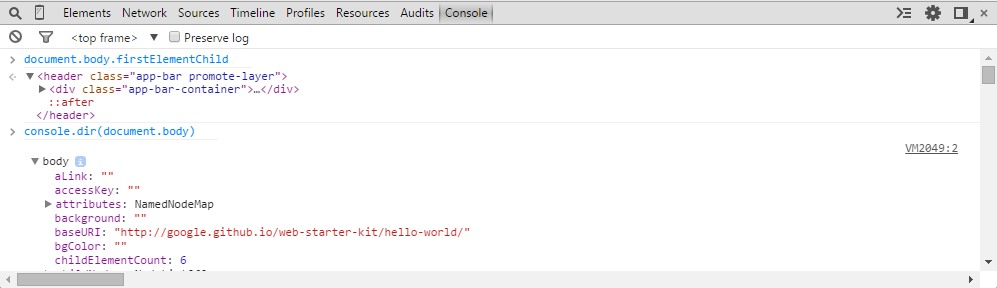

# Primeros pasos con Javascript

- [Introducción a Javascript](https://developer.mozilla.org/es/docs/Web/JavaScript/Guide/Introducci%C3%B3n#Where_to_find_JavaScript_information)    
- [Fundamentos de JavaScript](https://developer.mozilla.org/es/docs/Learn/Getting_started_with_the_web/JavaScript_basics)    

- Para empezar a programar con javascript sólo necesitamos
    - Un editor de texto como puede ser [Sublime Text](https://www.sublimetext.com/)
    - Las herramientas de desarrollo de un navegador web cómo pueden ser [las de Google Chrome](https://developer.chrome.com/devtools)

## Sublime Text 

- Es uno de los editores más populares para Javascript (y Frontend en general). Algunos lo ven como la evolución natural del famoso [Vim](http://www.vim.org/). Otra alternativa bastante buena a Sublime es [atom](https://atom.io/)
- Es un editor [MUY potente](https://scotch.io/bar-talk/the-complete-visual-guide-to-sublime-text-3-getting-started-and-keyboard-shortcuts) y rápido.
- Sublime Text funciona sobre todo a base de paquetes (plugins, add-ons..)
    - Tienes que instalarte primero [Package Control](https://packagecontrol.io/installation) para poder añadir paquetes a Sublime
    - Puedes [encontrar paquetes para casi todo](https://packagecontrol.io/)
- Entre las cosas que puedes hacer con Sublime estan:
    - Command palette, acceso a TODAS las opciones de sublime desde un unico sitio
    - Modo libre de distracciones
    - Navegación entre archivos muy rápido
    - Selection (y edición) multiple 
    - Auto-completado con snippets (nos podemos montar los nuestros)

## La Consola (de Javascript) de Chrome

- La consola de Chrome es el sitio donde puedes probar el código de manera interactiva.  Forma parte de las herramientas para desarrolladores (Chrome Developer Tools, DevTools) de Chrome
- Para abrir las DevTools podemos hacer:
    - _Menú_ > _Más herramientas_ > _Herramientas para desarrolladores_
    - Botón derecho en cualquier elemento de la página y _Inspeccionar elemento_
    - Combinaciones de teclas: `Ctrl+Shift+I` para Windows o `Cmd+Opt+I` para Mac
- En DevTools tenemos disponibles varias herramientas (entre ellas las consola):
    + Elements
    + Resources
    + Network
    + Sources
    + Timeline
    + Profiles
    + Audits
    + **Console**
    


- Con la consola de javascript podemos:
    - mostrar mensajes desde nuestro código (con [`console.log`](https://developer.mozilla.org/es/docs/Web/API/Console/log))
    - interactuar con la página cargada utilizando javascript
    - ejecutar comandos javascript y ver su resultado en tiempo real



> Muchos de los ejemplos que encontraras en este libro puedes copiarlos y pegarlos en la consola directamente para ver el resultado

Puedes probar a copiar y pegar [este código](https://developer.mozilla.org/es/docs/Web/JavaScript/Guide/Introducci%C3%B3n#Hola_Mundo) en la consola

```javascript
// Declaramos una funcion llamada saludar, que lleva
// 'nombre' como argumento.
function saludar(nombre) {
  // Cuando se llama, esta funcion devuelve "Hola " 
  // y el nombre que se le ha pasado como argumento.
  return "Hola " + nombre; 
}

saludar("Usuario"); // Nos devolvera "Hola Usuario".
```

## Javascript en la página HTML

- El código javascript se guarda en archivos `.js`
- El código javascript se ejecuta en una pagina web a traves del tag [`<script>`](https://developer.mozilla.org/es/docs/Web/HTML/Elemento/script)

Con este tag podemos cargar un archivo `.js` que contenga código javascript
```html
    <script src="scripts/main.js"></script>
```

O podemos cargar directmente el código javascript que queremos que se ejecute cuando se cargue la página

```html
    <script type="text/javascript">
        console.log("Hello from my script tag...");
        alert("I'm saying HI!!");
    </script>
```

- Los elementos de una páginas web pueden ser accedidos por javascript a traves del [DOM](https://en.wikipedia.org/wiki/Document_Object_Model) que:
    - estructura el código HTML como elementos en forma de arbol
    - provee a javascript de métodos para acceder a (y modificar) estos elementos de multiples maneras

Ejemplo de código javascript accediendo (y modificando) elementos de HTML

```javascript
    var miTitulo = document.querySelector('h1');
    miTitulo.innerHTML = 'Hello world!';
```


