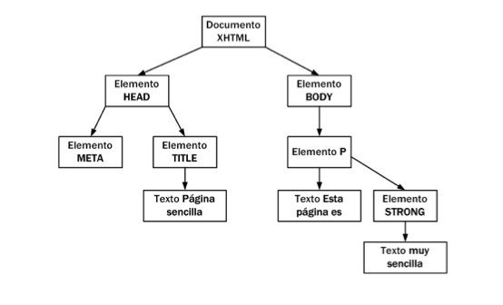

# DOM (el documento HTML en el navegador)

El **[DOM (Document Object Model)](http://www.w3.org/DOM/)** es una forma de representar un documento HTML (o XML) como un árbol de nodos.  
Utilizando los métodos y propiedades del DOM podremos acceder a los elementos de la página, modificarlo, eliminarlos o añadir nuevos

```html
<!DOCTYPE html PUBLIC "-//W3C//DTD XHTML 1.0 Transitional//EN"
"http://www.w3.org/TR/
xhtml1/DTD/xhtml1-transitional.dtd">
<html xmlns="http://www.w3.org/1999/xhtml">
    <head>
        <meta http-equiv="Content-Type" content="text/html; charset=iso-8859-1" />
        <title>Página sencilla</title>
    </head>
    <body>
        <p>Esta página es <strong>muy sencilla</strong></p>
    </body>
</html>
```



En cualquier página web tenemos disponible el objeto `document` que contiene multitud de métodos y propiedades para interactuar con el DOM. 

## Selección (nativa) de elementos 

El objeto `document` provee de métodos para seleccionar nodos. Estos métodos devuelven objetos [`element`](https://developer.mozilla.org/es/docs/Web/API/Element) a través de los cuales podremos acceder a las propiedades de estos nodos.

Dado este HTML...

```html
<!DOCTYPE html>
<html>
<head>
  <title>Example</title>
</head>
<body>
     <p id="name">juanma<p>
     <ul id="guitar-players">
        <li id="jimi" class="rock blues">Jimi Hendrix</li>
        <li class="blues"><a href="http://www.ericclapton.com/">Eric Clapton</a>a></li>
        <li class="rock">Eddie Van Halen</li>
        <li class="rock">Yngwie Malmsteen</li>
        <li class="jazz">Django Reinhardt</li>
        <li class="blues"><a href="http://www.bbking.com/">B.B.King</a></li>
        <li class="blues rock">Gary Moore</li>
     </ul>
</body>
</html>
```

Algunos de estos métodos para seleccionar elementos son:

- [`document.getElementById()`](https://developer.mozilla.org/es/docs/Web/API/Document/getElementById) Devuelve una referencia al elemento por su ID

```javascript
    var myName = document.getElementById(“name”);
```

- [`document.getElementsByClassName()`](https://developer.mozilla.org/es/docs/Web/API/Document/getElementsByClassName) o [`element.getElementsByClassName`](https://developer.mozilla.org/en-US/docs/Web/API/Element/getElementsByClassName) Devuelve una lista de elementos (llamada [HTMLCollection](https://developer.mozilla.org/es/docs/Web/API/HTMLCollection)) con los nombres de clase indicados

```javascript

    var bluesGuitarPlayers = document.getElementsByClassName('blues')
    var rockGuitarPlayers = document.getElementsByClassName('rock')

    // or to restrict the search in an element...
    var myList = document.getElementById("guitar-players");
    var myBluesGuitarPlayers = myList.getElementsByClassName('blues')
    var myRockGuitarPlayers = myList.getElementsByClassName('rock')

    console.log( myRockGuitarPlayers[0].innerHTML )
    console.log( myRockGuitarPlayers.item(0).innerHTML )
    console.log( myRockGuitarPlayers.namedItem("jimi").innerHTML )

    for (var i = 0; i < myRockGuitarPlayers.length; ++i) {
      var link = myRockGuitarPlayers[i];  
      console.log(link.innerHTML);
    }

```

- [`document.getElementsByTagName()`](https://developer.mozilla.org/en-US/docs/Web/API/Document/getElementsByTagName) o [`element.getElementsByTagName()`](https://developer.mozilla.org/en-US/docs/Web/API/Element/getElementsByTagName) Devuelve una lista de elementos (HTMLCollection) con un tipo de tag determinado

```javascript
    var links = document.getElementsByTagName('a')
    
    // or to restrict the search in an element...
    var myList = document.getElementById("guitar-players");
    var linksGuitarPlayers = myList.getElementsByTagName('a')
```

- [`document.querySelector()`](https://developer.mozilla.org/es/docs/Web/API/Document/querySelector) o [`element.querySelector()`](https://developer.mozilla.org/en-US/docs/Web/API/Element/querySelector) Retorna _el primer elemento_ dentro del documento que coincide con el grupo especificado de selectores.

```javascript
    var linkBluesGuitarPlayer = document.querySelector('#guitar-players .blues a')
    
    // or to restrict the search in an element...
    var myList = document.getElementById("guitar-players");
    var linkBluesGuitarPlayer = myList.querySelector('.blues a')
    console.log(linkBluesGuitarPlayer.href);
```

- [`document.querySelectorAll()`](https://developer.mozilla.org/en-US/docs/Web/API/Document/querySelectorAll) o [`element.querySelectorAll()`](https://developer.mozilla.org/en-US/docs/Web/API/Element/querySelectorAll) Devuelve una lista de los elementos (una [NodeList](https://developer.mozilla.org/es/docs/Web/API/NodeList)) que coinciden con el grupo especificado de selectores

```javascript
    var linksBluesGuitarPlayers = document.querySelectorAll('#guitar-players .blues a')
    
    // or to restrict the search in an element...
    var myList = document.getElementById("guitar-players");
    var linksBluesGuitarPlayers = myList.querySelectorAll('.blues a')

    for (var i = 0; i < linksBluesGuitarPlayers.length; ++i) {
      var link = linksBluesGuitarPlayers[i];  
      console.log(link.href);
    }
```

- Examples live at: https://jsfiddle.net/juanma/ctmsekgz/

## Selección de elementos con jQuery

[jQuery](https://jquery.com/) es una libreria que nos provee de una serie de métodos y utilidades dentro del objeto `jQuery` (o `$`) que nos facilitan la interactuación con el DOM mediante javascript

Para utilizar jQuery tendremos que cargar la libreria antes de utilizar sus métodos

```html
<!doctype html>
<html>
<head>
    <meta charset="utf-8">
    <title>Demo</title>
</head>
<body>
    
    <a href="http://jquery.com/">jQuery</a>
    #leanpub-start-insert
    <script src="jquery.js"></script>
    #leanpub-end-insert
    <script>
 
    // Your code (with optional jquery code) goes here.
 
    </script>
</body>
</html>
```

### `$()` o [`jQuery()`](http://api.jquery.com/jQuery/)

Con jQuery podemos crear _objetos jQuery_ a partir de selecciones que pasamos como parametros al metodo `$()`. 

Con jQuery disponemos de una [potente herramienta de selección de elementos](https://learn.jquery.com/using-jquery-core/selecting-elements/)
 
- [How jQuery selects elements using Sizzle | blog.bigbinary.com](http://blog.bigbinary.com/2010/02/15/how-jquery-selects-elements-using-sizzle.html)  
- [jQuery Selectors | refcardz.dzone.com](http://refcardz.dzone.com/refcardz/jquery-selectors)

Para obtener los elementos utilizamos `$()` o `jQuery()` pasándole nuestra [selección CSS](http://api.jquery.com/category/selectors/) entre comillas

```javascript
var $linksBluesGuitarPlayers = $('#guitar-players .blues a')

// or to restrict the search in an element...
var $myList = $("#guitar-players");
var $linksBluesGuitarPlayers = $myList.find('.blues a')

$linksBluesGuitarPlayers.each (function(index,element) {
  console.log( $( this ).text() );
  console.log( "index:",index );
  console.log( "element:",element );
})
```

## Selección nativa vs selección jQuery

`$()` devuelve un [objeto jQuery](http://api.jquery.com/Types/#jQuery) (que no es un elemento DOM y tiene acceso a métodos propios de jQuery)

Estas diferencias hay que tener en cuentas para [recorrer los elementos de las selecciones](https://learn.jquery.com/using-jquery-core/iterating/) y para acceder a las propiedades de los elementos

Podemos pasar de objeto jQuery a selección DOM: 

- Para un elemento

`$('#container') -> $('#container')[0]`

- Para un grupo de elementos

`$('.hidden') -> $('.hidden').toArray()` 

Tambien podemos pasar de selección DOM a objeto jQuery:

- Para un elemento: 

`document.getElementById('container') -> $(document.getElementById('container'))`

- Para un grupo de elementos: 

`document.links -> $(document.links);`

```javascript
>>> $('#container');
jQuery(div#container)
>>> $('#container')[0]

<div id="container">
>>> $('#footer_contents')
jQuery(div#footer_contents.clearfix)
>>> $('#footer_contents')[0]

<div id="footer_contents" class="clearfix">
>>> $('#footer_contents').attr("class");
"clearfix"
>>> $('#footer_contents').className
undefined
>>> $('#footer_contents')[0].className
"clearfix"
>>> $('#footer_contents')[0].attr("class");
 TypeError: $("#footer_contents")[0].attr is not a function

 >>> $('div.hidden')
 jQuery(div#ads_section_textlinks.clearfix, div#top_sales.top_box,
 div#top_valuated.top_box, div.list_container, div.ac_results)

 >>> $('div.hidden').toArray()
 [div#ads_section_textlinks.clearfix, div#top_sales.top_box,
 div#top_valuated.top_box, div.list_container, div.ac_results]

 >>> $('div.hidden').toArray()[0]
 <div id="ads_section_textlinks" class="clearfix
 hidden" style="display: block;">

 >>> document.getElementById('ads_section_textlinks');
 <div id="ads_section_textlinks" class="clearfix
 hidden" style="display: block;">

 >>> $(document.getElementById('ads_section_textlinks'));
 jQuery(div#ads_section_textlinks.clearfix)

 >>> $(document.querySelectorAll('div.hidden')[0]);
 jQuery(div#ads_section_textlinks.clearfix)
```


